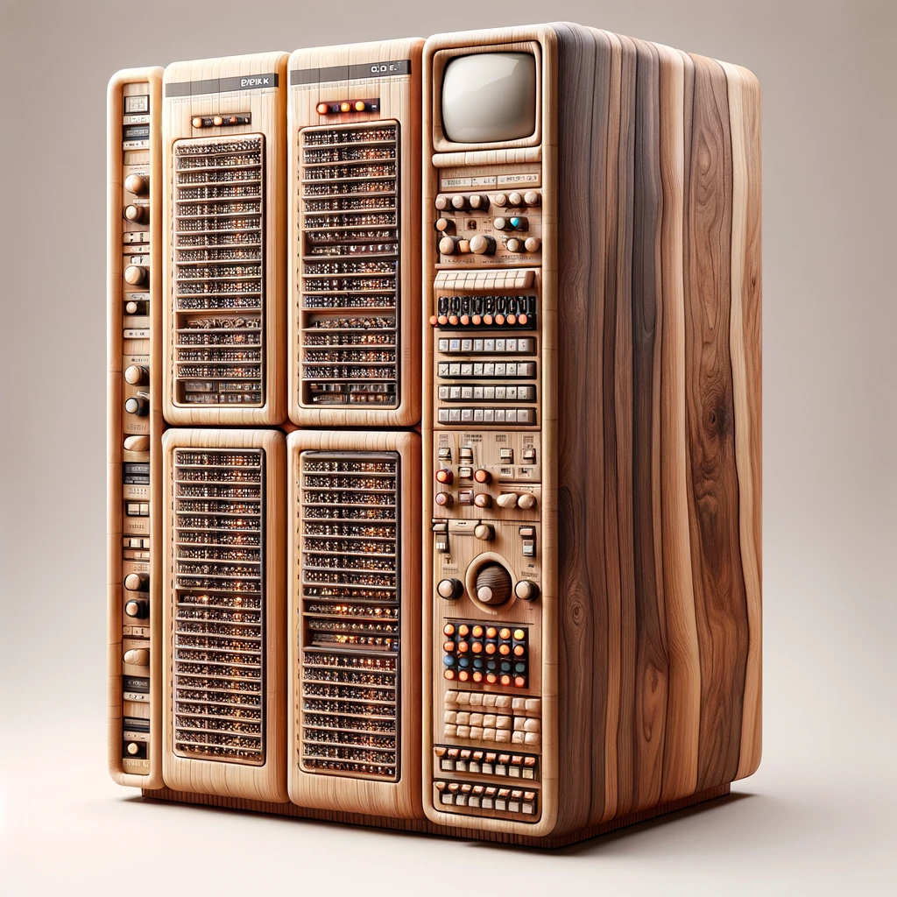

# BALSA

# BALSA Basic Assembly Language Source Assist

# Project Objective

Existing LLM code assist models are focused on modern programming languages: python, javascript, etc.

Mainframe developers particulary, mainframe assembly developers are rare.  Its a hard to develop skill and 
not the focus of most educational instutitions.

This project attempts to apply GenAI to assist developers learning Mainframe Assembly with the simplest
subset of the language - Basic Assembly Language BAL circa 1960s.

Why BAL and not HASM?  BAL is a smaller target and more resources are available to the open source developer.

# Guide to the repo

* data dir
    - Any files used as data for either model training or testing 
    - csv files
    - jsonl files 
* docs dir
    - contains documents and notes for development
* img dir
    - any images used by the github markdown files or webapps
* notebooks
    - notebooks and venv location
* scripts
    - code which is not in a notebook
* webapp
    - code which for GCP App Engine web apps

# Design decisions

OpenAI appears to be the current leader in terms of GenAI.  We are not trying to develop new models or invent anything.  We
are simply trying to use what is currently avaialable.  For our purposes, we will need to tune an existing model.  While
GCP Vertex AI would be my preferred approach, it is cost prohibitive.  On the other hand, OpenAI GPT models are relatively 
cheap to tune.
